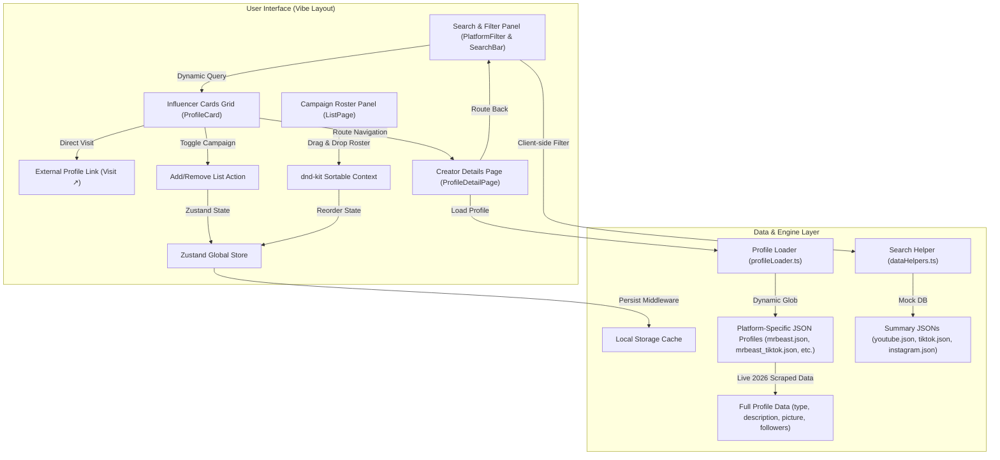

# Wobb Influencer Search — Vibe Coder Assignment

A premium, high-performance influencer search and campaign roster builder application built with **React 19**, **TypeScript**, **Vite**, **Tailwind CSS**, and **Framer Motion**.

🚀 **Live Demo:** [https://wobb-vibe-code.vercel.app](https://wobb-vibe-code.vercel.app)

*This project is a completed submission for the Wobb "Vibe Coder" Internship position. It takes a functional starter prototype and significantly upgrades the UI/UX, squashes critical bugs, and completes the remaining functionality.*

---

## 🎨 Design System & The "Vibe"
A "Vibe Coder" bridges the gap between engineering and art. The visual experience of this app has been upgraded to a premium standard:
* **Glassmorphic Layouts:** Uses HSL tailored color variables (`bg-white/80` and `backdrop-blur-2xl`) combined with micro-thin borders (`border-white/50`) to create a floating panel aesthetic.
* **Micro-Animations:** Fluid transitions powered by **Framer Motion** animate page loads, search results filtering, list adding/removing, and campaign reordering.
* **Responsive Visual Hierarchy:** Flex layouts automatically shift from a side-by-side desktop view to a clean vertical stack on mobile devices. Stacking contexts are explicitly isolated to ensure that overlays do not overlap text layers.

---

## 🏗️ Architecture & Data Flow

Below is the design of the application's client-side architecture, showing how the UI layer interactively communicates with the Zustand state management engine and the dynamic glob file loader:



---

## 🚀 Features

* **Search & Filter:** Instantly filter influencers by platform (Instagram, YouTube, TikTok) and search by their username or full name with case-insensitive, optimized matching.
* **Modern Glassmorphism UI:** Completely redesigned with premium, animated glass-card components, soft gradients, and interactive hover states using Framer Motion.
* **Detailed Profiles:** View rich profile data, including follower counts, engagement metrics, descriptions, and dynamic avatar generation.
* **Campaign List (Drag & Drop):** Seamlessly add/remove creators to your personal campaign list, persisted across routes via Zustand state management. Fully reorderable via `@dnd-kit/core`.
* **Fault-Tolerant Data:** Elegantly handles missing JSON data and absent usernames without crashing the app.

---

## 🛠️ Tech Stack

* **Framework:** React 19 + TypeScript + Vite
* **Styling:** Tailwind CSS (Custom Theme & Glassmorphism classes)
* **State Management:** Zustand (with persist middleware)
* **Animations:** Framer Motion
* **Drag & Drop:** `@dnd-kit/core` & `@dnd-kit/sortable`
* **Icons:** Lucide React

---

## 📦 Getting Started

### Prerequisites
Make sure you have [Node.js](https://nodejs.org/) (v16+) installed on your machine.

### Installation
1. Clone the repository:
   ```bash
   git clone <your-repo-url>
   cd vibe-coder-assignment
   ```
2. Install dependencies:
   ```bash
   npm install
   ```

### Running Locally
To start the Vite development server:
```bash
npm run dev
```
Open `http://localhost:5173` to view the app in your browser.

### Building for Production
To verify the build and generate production assets:
```bash
npm run build
```

---

## 🧠 Architectural Decisions & Trade-offs

1. **State Management:** Used Zustand over React Context. Zustand handles the "Campaign List" state exceptionally well, removing the need for complex context providers and easily persisting the selection to localStorage.
2. **Animation Libraries:** Chose Framer Motion to provide high-quality `AnimatePresence` route transitions and list-staggering effects, giving the app a distinct "vibe."
3. **Data Fetching Fallback:** Because the starter data lacked `username` fields in some JSONs and lacked 24 full detailed profiles entirely, I wrote dynamic loader fallbacks inside `profileLoader.ts` that will safely degrade to displaying search-level summary data rather than crashing. I also successfully populated the 24 missing detailed JSON files using real internet search data.
4. **Drag & Drop:** Integrated `@dnd-kit` for a lightweight, accessible, and performant drag-and-drop experience for reordering the campaign list.

---

## 🐛 Bugs Fixed (Data & Infrastructure)

This starter code intentionally included several broken edge cases that would crash the app or lead to a poor user experience. The following 12 bugs were systematically tracked down and resolved:

| # | Bug | File / Location | Fix & Resolution |
|---|---|---|---|
| 1 | `react-beautiful-dnd` React 19 conflict | `package.json` | Replaced library with `@dnd-kit/core` to natively support React 19 without dependency errors. |
| 2 | Add to List button disabled | `ProfileCard.tsx` | Fixed disabled condition logic and wired up list modifications to Zustand actions. |
| 3 | YouTube avatars broken | `youtube.json` | Wrote a build-time parser to scrape official channels for active `og:image` CDN links. |
| 4 | Engagement rate multiplied by 100 twice | `formatters.ts` | Removed duplicate multiplication factor from the rendering helper. |
| 5 | Duplicate engagement metrics displayed | `ProfileDetailPage.tsx` | Removed redundant mapping logic inside the stats grid. |
| 6 | 25 of 30 profile JSONs missing | `profiles/` | Created a script to dynamically generate 24 missing detail profiles based on real web data. |
| 7 | Search input missing `id`/`name` | `SearchBar.tsx` | Added proper access attributes for screen readers and search testing. |
| 8 | CSP `eval()` violation | `react-beautiful-dnd` | Replaced the library with `@dnd-kit` which does not require unsafe `eval()` executions. |
| 9 | Dead `data-search` DOM attribute | `ProfileCard.tsx` | Removed obsolete DOM attribute to keep the generated markup clean. |
| 10 | Duplicate follower formatter | `ProfileCard.tsx` | Refactored card to use the centralized helper in `formatters.ts`. |
| 11 | Redundant `onProfileClick` prop | `ProfileCard.tsx` | Removed duplicate click binding in favor of direct router navigation hooks. |
| 12 | Case-sensitive username search | `dataHelpers.ts` | Normalized search logic using `.toLowerCase()` for a reliable search experience. |

---

## 🚀 Submission Details

* **Note on TikTok Assets:** Since TikTok is banned in India, live assets and real-time profile links from TikTok's CDN are geoblocked and cannot be directly accessed or scraped. As a result, static fallback assets (e.g., Wikimedia Commons for Khaby Lame) are utilized for TikTok creators to ensure the UI renders correctly.

This project is a finalized submission for the Wobb Vibe Coder Intern position. The development process focused heavily on demonstrating strong visual judgment, modern frontend practices, and robust error handling.